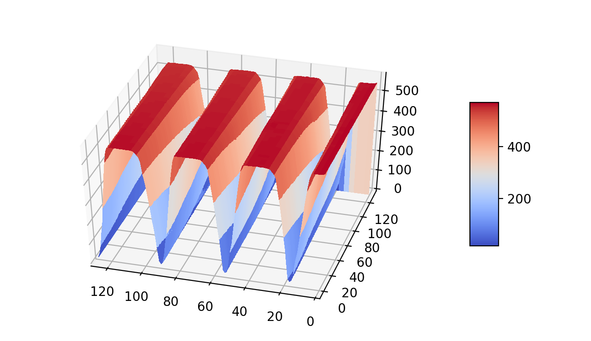

# Atomic-force-microscope Viewer

### Description
View images with an atomic force microscope.  
The Z axis is captured in nanometers and measurements are made for a 128x128 matrix
The image that is represented was captured with an atomic force microscope supplied by the University of Pisa.
A 5x5 micrometer object was observed.  
In particular, the object is a silicon slide with parallel grooves.
